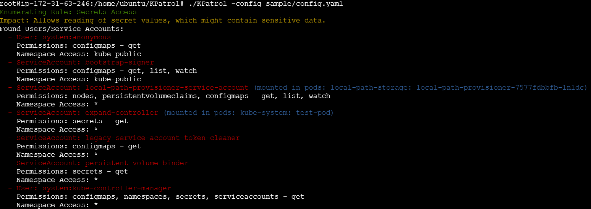

# KPatrol
A simple yet powerful auditing tool for Kubernetes to identify users and service-accounts with sensitive permissions. 

## Why did I make this tool ?

KPatrol was created to solve a problem I faced while reviewing permissions on a Kubernetes cluster during a pentest engagement. Driven by a curiosity to learn Go and with the power of ChatGPT and Copilot at my disposal, I developed a simple yet powerful tool to audit permissions on a Kubernetes cluster which can be used during pentest or audit engagements.

## Features

- **Custom Policies**: Define sensitive permissions and exceptions in a YAML configuration file.
- **Exclusion Rules**: Easily define rules to exclude specific users, service accounts, namespaces, or resources.
- **Simple Configuration**: Easy-to-understand YAML configuration without the need to learn Rego or any other policy languages.

## How is it different than kubiscan?

- **Custom Project**: This project was created out of passion without being fully aware of kubiscan. kubiscan is a very powerful tool, and I would suggest you use it if you like it. However, this tool was created for me to learn Go and to add some custom features that I and many others I've interacted with as security engineers require.
- **Focus**: The focus is on existing users/service accounts that already have sensitive access rather than auditing roles/cluster roles. Roles/cluster roles are only risky if attached to a user.This tool gives your immediate and high-impact action points to start working on.
- **Exceptions Handling**: Easily add exceptions to exclude specific users, service accounts, namespaces, or resources.

## Usage

To run KPAtrol with your custom configuration, use the following command:

```bash
./kpatrol -config config.yaml
```


A sample config file along with the sample rbac roles to test can be found in the **sample_configs** direcotry.

## Configuration

To customize KPAtrol, create a `config.yaml` file. Below is an example and a brief explanation of each section:

```yaml
sensitivePermissions:
  - name: "Secrets Access"
    resources: ["secrets", "configmaps"]
    verbs: ["get", "list", "watch"]
    impact: "Allows reading of secret values, which might contain sensitive data."
    apiGroups: [""]
    exclusions:
      users: ["system:admin", "token-cleaner"]
      serviceAccounts: ["default:my-service-account"]

  - name: "Persistent Volume Management"
    resources: ["persistentvolumes", "persistentvolumeclaims"]
    verbs: ["create", "delete", "patch", "update"]
    impact: "Allows management of persistent volumes which can lead to data exposure or loss."
    apiGroups: [""]
    exclusions:
      users: ["system:node"]
      serviceAccounts: ["default:pv-manager"]
      namespaces: ["default"]
      resources: ["pods"]
      actions: ["create"]
```
### Writing the Config File
#### Define Sensitive Permissions: Specify permissions you consider sensitive
```
name: A descriptive name for the permission.
resources: List of Kubernetes resources the permission applies to.
verbs: The actions (verbs) that are considered sensitive.
impact: Description of the potential impact if the permission is misused.
apiGroups: (Optional) The API groups the resources belong to.
```
#### Add Exclusions: Optionally, exclude specific entities to prevent them from being flagged.
```
users: List of usernames to exclude.
serviceAccounts: List of service accounts to exclude.
namespaces: List of namespaces to exclude.
resources: List of resources to exclude.
actions: List of actions to exclude.
```

## TODO

- [ ] Add options to get output in different formats.
- [ ] Improve documentation.
- [ ] Add more examples to the configuration file.

